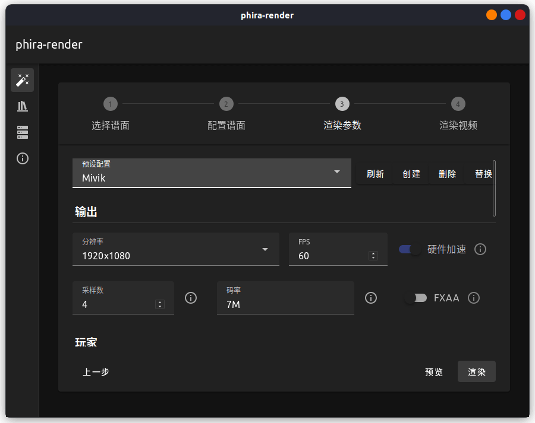
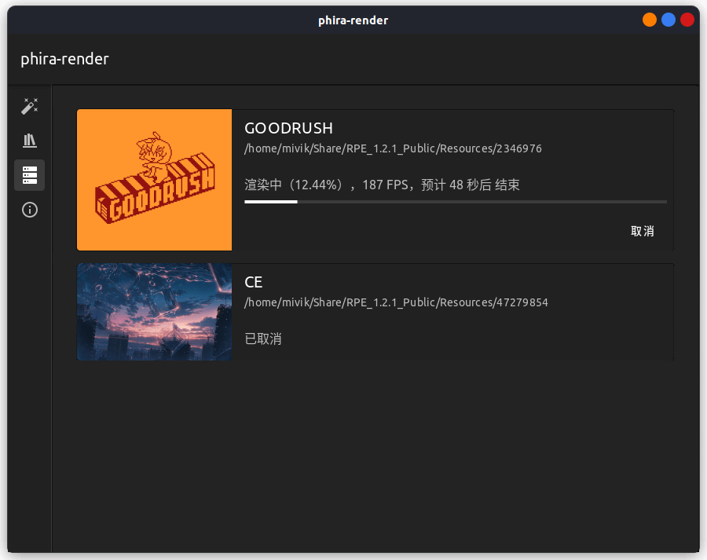

# phira-render

A helpful tool to render your Phigros charts. Built with Tauri + Vuetify.

## Features

- Ergonomic UI;
- Fast (3-4x boost compred to prpr-render);
- Bind RPE in few clicks;
- Task list;
- Add and manage multiple presets;
- ...

## Screenshots





## Installation

Check [Releases](https://github.com/TeamFlos/phira-render/releases).

## Manual build

Dev

```bash
cargo tauri dev
```

Build

```bash
cargo tauri build
```
